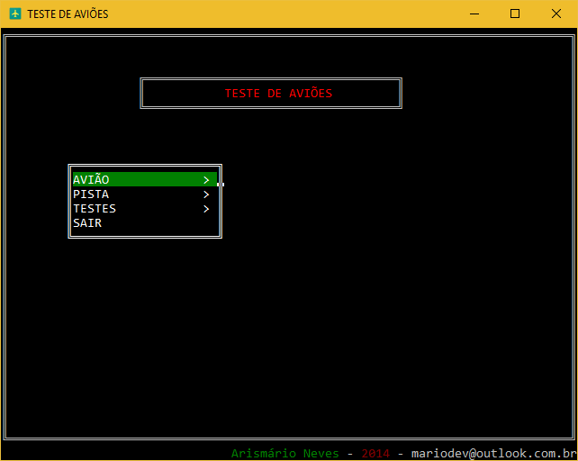

# Teste de Aviões

> Console

### Navegação

:arrow_up: : **Seta acima**

:arrow_down: : **Seta abaixo**

:arrow_forward: : **Enter**

:arrow_backward: :  **ESC**

### Descrição do Projeto

Uma empresa está necessitando desenvolver um programa para efetuar os testes nos seus aviões antes de entregá-los aos seus clientes em suas pistas de provas localizadas no Brasil. Por isso, você foi contratado para elaborar um programa que deverá atender a todos os aspectos relacionados a esta situação, tratando as seguintes informações:

-	Para cada Avião
	-	Código de identificação único fornecido pelo usuário composto sempre por 3 letras e 4 números;
	-	Modelo do avião;
	-	Capacidade do avião (quantidade de passageiros);
	-	Nome do cliente;
	-	País de origem do cliente.

-	Para cada Pista de Prova
	-	Código sequencial único gerado automaticamente com base no último valor registrado no arquivo;
	-	Endereço da pista;
	-	Estado da Unidade da Federação onde localiza-se a pista;
	-	Tamanho do circuito em quilômetros (valor real);
	-	Velocidade máxima permitida.

-	Para cada teste realizado:
	-	Identificação única do avião;
	-	Identificação única da pista;
	-	Data do teste com dia, mês e ano (data coletada do computador – conteúdo de pesquisa);
	-	Velocidade máxima conseguida no teste em quilômetros.

- Mais detalhes no arquivo [Word](https://github.com/arismarioneves/TesteAvioes/blob/master/Arquivos/Projeto.doc).

### Biblioteca :books:

[`Conio.c`](https://github.com/arismarioneves/TesteAvioes/blob/master/Arquivos/conio.c)

### IDE :computer:

[`Dev-C++`](https://sourceforge.net/projects/orwelldevcpp/)

### Bônus :star:

[`Bibliotecas de funções C`](https://github.com/arismarioneves/TesteAvioes/blob/master/Arquivos/conio.c)

